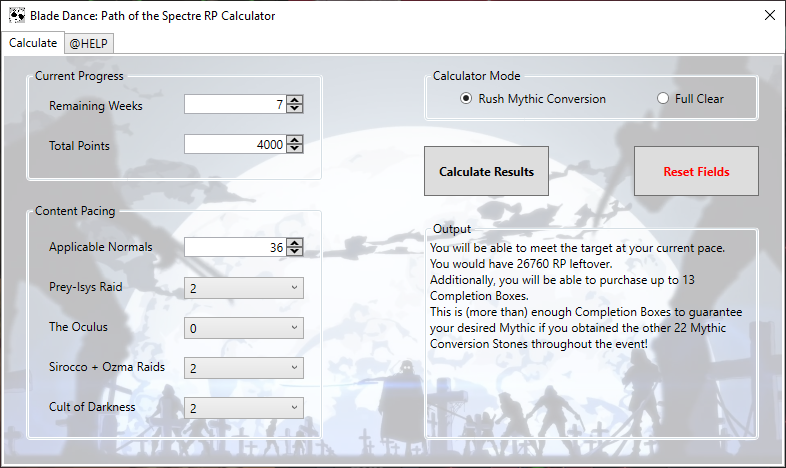

# Blade Dance: Path of the Spectre RP Calculator

A simple C# WPF program used to calculate the user's current pace towards DFO's [Path of the Spectre shop in the Song of the Spectre event.](https://www.dfoneople.com/pg/Song_of_the_Spectre)

I used the code from my [Quadrathlon Calculator](https://github.com/hishigami/Quadrathlon-Calculator) as a base for developing this program given the structural similarities between both events,
even with the significantly higher stakes involved for the Song of the Spectre event.

The .NET Core Runtime must be installed to run this app.